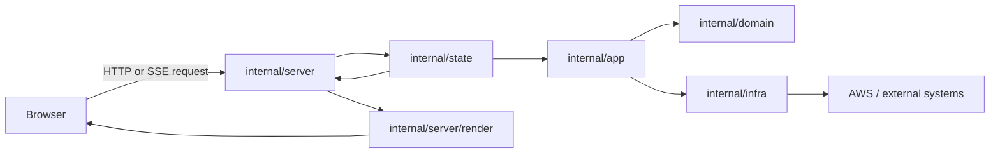
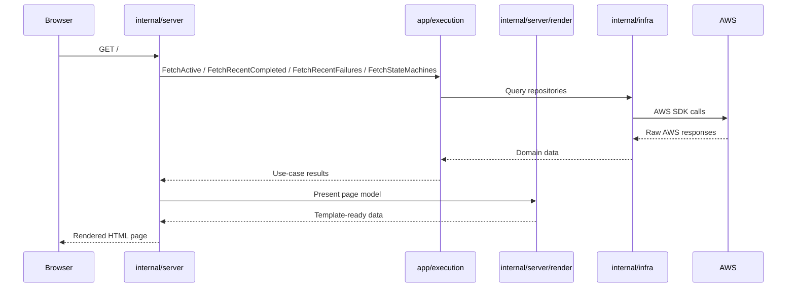
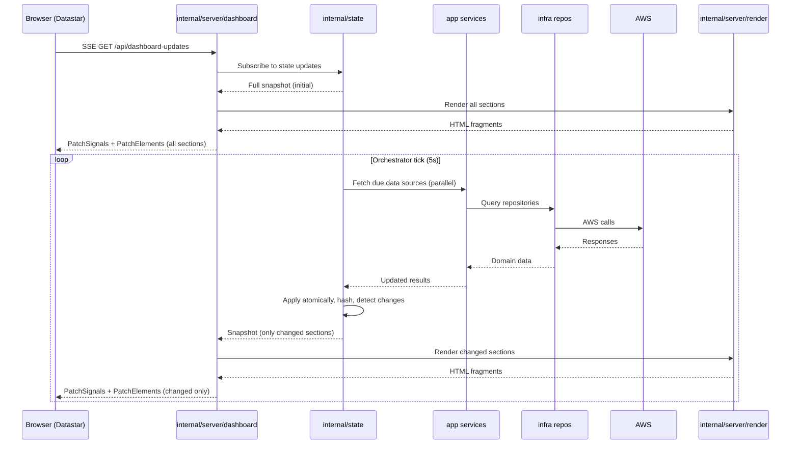
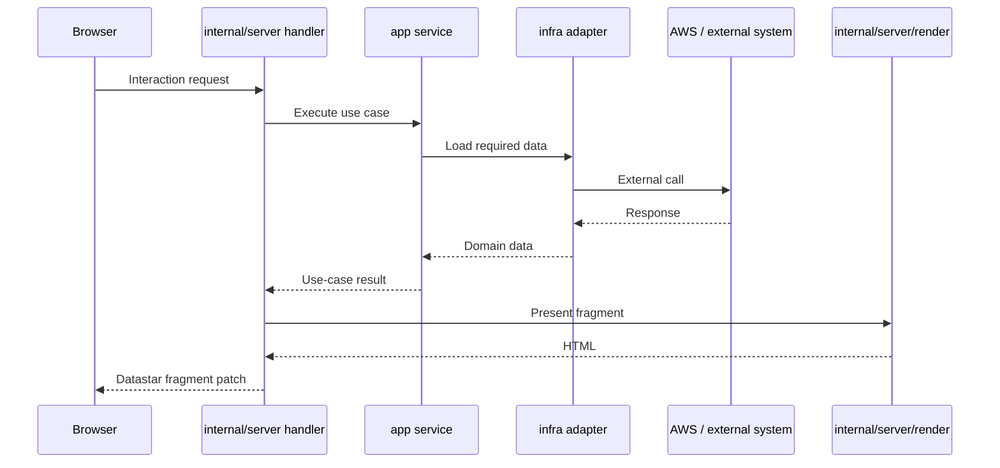

# Architecture and Request Flow

This application follows a **Clean Architecture** style split:

```sh
┌───┬────────────────────────────────┬───────────────────────────────┬───────────────────────────────────────────────────────────────┐
│ # │             Layer              │                  Package(s)   │                        Responsibility                         │
├───┼────────────────────────────────┼───────────────────────────────┼───────────────────────────────────────────────────────────────┤
│ 1 │ Composition root               │  `cmd/`                       │  Wires everything together at startup. Creates infra          │
│   │                                │                               │ adapters, app services, and the HTTP server.                  │
├───┼────────────────────────────────┼───────────────────────────────┼───────────────────────────────────────────────────────────────┤
│ 2 │ Delivery / interface adapters  │  `internal/server/`           │  Handles HTTP, SSE, route registration, request parsing,      │
│   │                                │                               │ response rendering, and Datastar fragment updates.            │
├───┼────────────────────────────────┼───────────────────────────────┼───────────────────────────────────────────────────────────────┤
│ 3 │ Presentation adapters          │  `internal/server/render/`    │  Converts domain/app results into template-friendly view      │
│   │                                │                               │ models and renders fragments/templates.                       │
├───┼────────────────────────────────┼───────────────────────────────┼───────────────────────────────────────────────────────────────┤
│ 4 │ Centralized state              │  `internal/state/`            │  Single source of truth for all dashboard data. The           │
│   │                                │                               │ orchestrator fetches data on schedule, updates state          │
│   │                                │                               │ atomically, and notifies subscribers of changes.              │
├───┼────────────────────────────────┼───────────────────────────────┼───────────────────────────────────────────────────────────────┤
│ 5 │ Use cases / application layer  │  `internal/app/`              │  Contains data-fetching logic: execution queries, Lambda      │
│   │                                │                               │ discovery + metrics, RDS metrics, search lifecycle,           │
│   │                                │                               │ notifications.                                                │
├───┼────────────────────────────────┼───────────────────────────────┼───────────────────────────────────────────────────────────────┤
│ 6 │ Domain                         │  `internal/domain/`           │  Core business types and pure rules: execution models, state  │
│   │                                │                               │ machine rules, search match types, Lambda/RDS domain types.   │
│   │                                │                               │ No AWS or HTTP concerns.                                      │
├───┼────────────────────────────────┼───────────────────────────────┼───────────────────────────────────────────────────────────────┤
│ 7 │ Infrastructure                 │  `internal/infra/`            │  Talks to AWS, desktop notifications, remote joke APIs, and   │
│   │                                │                               │ other external systems. Implements the ports used by          │
│   │                                │                               │ `internal/app/`.                                              │
├───┼────────────────────────────────┼───────────────────────────────┼───────────────────────────────────────────────────────────────┤
│ 8 │ Shared utility                 │  `internal/config/`           │  Runtime configuration loading and defaults.                  │
└───┴────────────────────────────────┴───────────────────────────────┴───────────────────────────────────────────────────────────────┘
```

## What each area is supposed to do

### `cmd/`
- Build the object graph.
- Decide which concrete adapters are used.
- Pass dependencies into `server.NewServer(...)`.

### `internal/server/`
- Accept HTTP requests.
- Subscribe to `internal/state` for dashboard SSE updates.
- Handle on-demand SSE streams (search, state machine executions).
- Return HTML or Datastar patch fragments.
- **Should not** contain business rules or AWS SDK calls.

### `internal/server/render/`
- Map domain/application results into template-facing shapes.
- Keep formatting concerns out of `domain` and `app`.
- Build JSON preview HTML for S3 payload inspection.

### `internal/state/`
- **Single source of truth** for all dashboard data (server-side Redux pattern).
- `DashboardState` holds: active executions, completed, failures, RDS metrics, Lambda metrics, state machines, credential error state, and active count.
- The `Orchestrator` is a single goroutine that fetches data from app services on schedule, applies changes atomically, detects diffs via content hashing, and notifies subscribers.
- Flash/new-item detection and desktop notifications are triggered here.
- SSE handlers subscribe to state updates and render only the changed sections.

### `internal/app/`
- Own the data-fetching logic (pure fetchers — no caching or state management).
- Examples:
  - `app/execution`: active/recent execution fetches from AWS, credential error detection, per-env throttling
  - `app/search`: in-memory search jobs, progress, cancellation, result streaming
  - `app/lambda`: Lambda discovery + per-function metrics collection
  - `app/rds`: RDS performance insight fetching
  - `app/notification`: dedupe + readiness logic for desktop notifications

### `internal/domain/`
- Hold the core models used by the app:
  - `execution`: summaries, details, execution state history
  - `statemachine`: state machine identity and naming/filter helpers
  - `search`: record and string match results
  - `lambda`, `rds`: metrics and pure calculations
- **Should not** know about HTTP, templates, Datastar, or the AWS SDK.

### `internal/infra/`
- Implement the ports expected by `internal/app/`.
- Wrap AWS APIs, desktop notify, and external HTTP calls.
- Translate raw external responses into domain-facing data.

## Clean Architecture mapping

```sh
┌───┬────────────────────────────┬───────────────────────────────────────────────────────┐
│ # │  Clean Architecture term   │                       This repo                       │
├───┼────────────────────────────┼───────────────────────────────────────────────────────┤
│ 1 │  Entities / domain models  │  `internal/domain/*`                                  │
├───┼────────────────────────────┼───────────────────────────────────────────────────────┤
│ 2 │  Use cases                 │  `internal/app/*`                                     │
├───┼────────────────────────────┼───────────────────────────────────────────────────────┤
│ 3 │  State management          │  `internal/state/*`                                   │
├───┼────────────────────────────┼───────────────────────────────────────────────────────┤
│ 4 │  Interface adapters        │  `internal/server/*`, `internal/server/render/*`      │
├───┼────────────────────────────┼───────────────────────────────────────────────────────┤
│ 5 │  Frameworks / drivers      │  `internal/infra/*`, HTTP runtime, AWS SDK, Datastar  │
└───┴────────────────────────────┴───────────────────────────────────────────────────────┘

```
---

## Centralized State Architecture

The dashboard uses a **server-side Redux** pattern: one store, one writer, subscribers get notified of changes.

```
┌─────────────────────────────────────────────────────────────┐
│                    Orchestrator Goroutine                   │
│  (single writer — fetches on schedule, updates state)       │
│                                                             │
│  Tick (5s) → check which sources are due → fetch in parallel│
│           → lock state → apply all results atomically       │
│           → compute section hashes → notify subscribers     │
└─────────────────────────────┬───────────────────────────────┘
                              │ Snapshot (only changed sections)
                              ▼
┌─────────────────────────────────────────────────────────────┐
│                     DashboardState                          │
│  Active | Completed | Failures | RDS | Lambda | StMachines  │
│  CredentialError | ActiveCount | version                    │
│  (single RWMutex — one writer, many readers)                │
└─────────────────────────────┬───────────────────────────────┘
                              │ subscribe/notify
                              ▼
┌──────────────────────────────────────────────────────────────┐
│          SSE Handler (per-client)                            │
│  Receives Snapshot → renders only changed sections           │
│  → sends PatchSignals + PatchElements in sequence            │
└──────────────────────────────────────────────────────────────┘
```

### Key properties

- **Atomic updates**: When multiple data sources change on the same tick, all updates are applied under a single lock and pushed to clients together. The UI never shows an intermediate inconsistent state.
- **Deduplication for all sections**: Content hashing (SHA-1) detects actual changes. If data is identical to the previous fetch, no re-render or push happens. This eliminates UI thrashing.
- **No silent drops**: Subscriber channels use a "latest-only" pattern (size-1 channel with drain-then-send). Clients always get the most recent state, never a stale intermediate.
- **Adaptive scheduling**: The orchestrator adjusts RDS polling interval dynamically — fast (30s) when executions are active, slow (30min) when idle.
- **Flash/new-item detection**: Centralized in the state layer. Items seen for the first time are marked `New: true` before being stored.

### Polling intervals

```sh
┌───┬────────────────────────┬─────────────────────────────┬─────────────────────────────────────────┐
│ # │        Section         │      Default interval       │                  Notes                  │
├───┼────────────────────────┼─────────────────────────────┼─────────────────────────────────────────┤
│ 1 │  Active executions     │  5s (configurable per-env)  │  Fastest; drives the orchestrator tick  │
├───┼────────────────────────┼─────────────────────────────┼─────────────────────────────────────────┤
│ 2 │  Completed executions  │  5s                         │  Same as active                         │
├───┼────────────────────────┼─────────────────────────────┼─────────────────────────────────────────┤
│ 3 │  Recent failures       │  5s                         │  Same as active                         │
├───┼────────────────────────┼─────────────────────────────┼─────────────────────────────────────────┤
│ 4 │  RDS metrics           │  30s active / 30min idle    │  Adaptive based on active count         │
├───┼────────────────────────┼─────────────────────────────┼─────────────────────────────────────────┤
│ 5 │  Lambda metrics        │  60s                        │  Per-function caching within fetch      │
├───┼────────────────────────┼─────────────────────────────┼─────────────────────────────────────────┤
│ 6 │  State machines        │  5min                       │  Expensive discovery; slower cycle      │
└───┴────────────────────────┴─────────────────────────────┴─────────────────────────────────────────┘
```

---

## High-level request flow



### Flow in words
1. The browser sends a request to `internal/server`.
2. For the dashboard SSE stream, the server subscribes to `internal/state`.
3. The state orchestrator calls app service fetch methods on schedule.
4. App services call infra adapters which talk to AWS.
5. The orchestrator applies results atomically and notifies subscribers.
6. The server uses `internal/server/render` to turn changed sections into HTML fragments.
7. The browser receives Datastar patches that update the DOM in place.

---

## Initial page load flow (`GET /`)



This is the **initial shell render**. After that, Datastar opens the live SSE connection.

---

## Live dashboard update flow (`GET /api/dashboard-updates`)

The dashboard uses a **single SSE connection** for live updates, backed by the centralized state.



What this means:
- The **state orchestrator** owns the polling schedule and change detection.
- **App services** are pure data fetchers — no caching, no state, no side effects.
- The **server handler** only subscribes to state and renders snapshots into SSE patches.
- Clients get **consistent, batched updates** — all sections that change in the same tick arrive together.

---

## Interactive request flow

Examples:
- `/api/state-machine-executions`
- `/api/execution-states`
- `/api/record-search`
- `/api/s3-preview`
- `/api/s3-prefix-list`



These requests are **on-demand**, unlike the dashboard SSE stream which is long-lived and continuously updated. They are NOT part of the centralized state because they are per-user, per-interaction, and ephemeral.

---

## Responsibility boundaries to protect

When changing code, try to preserve these rules:

1. `internal/server/*` should not import the AWS SDK or infra AWS client packages directly.
2. `internal/app/*` should depend on interfaces/ports, not concrete AWS clients.
3. `internal/domain/*` should stay pure and framework-free.
4. `internal/infra/*` should be the only place that knows how to talk to AWS or other external systems.
5. `internal/state/*` is the only place that owns dashboard-wide mutable state and polling coordination.
6. Formatting and display helpers belong in `internal/server/render/*`, not in domain types.

---

## Practical mental model

If you are deciding where code belongs:

- **"This is an HTTP concern"** -> `internal/server`
- **"This is how the UI should display the data"** -> `internal/server/render`
- **"This coordinates dashboard-wide state and polling"** -> `internal/state`
- **"This fetches data from external sources"** -> `internal/app`
- **"This is a pure model or rule"** -> `internal/domain`
- **"This calls AWS / OS / external APIs"** -> `internal/infra`
